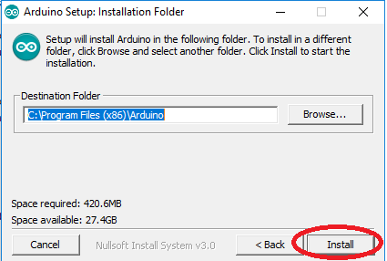
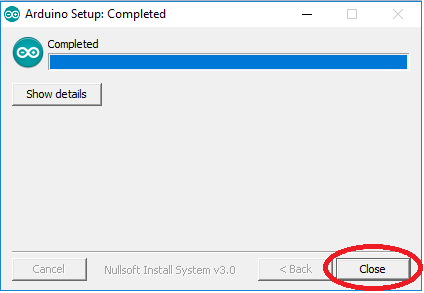
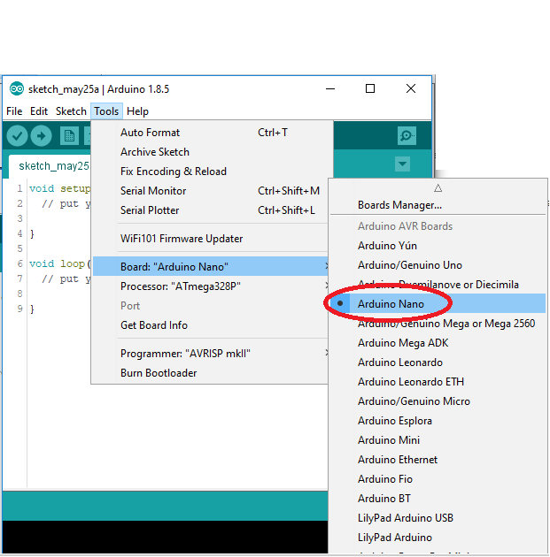
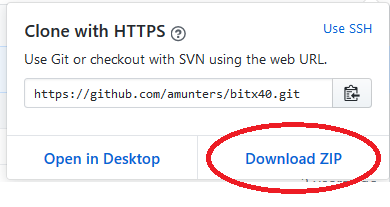
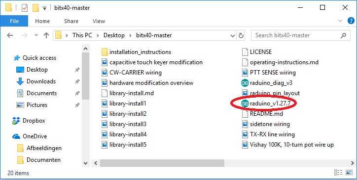
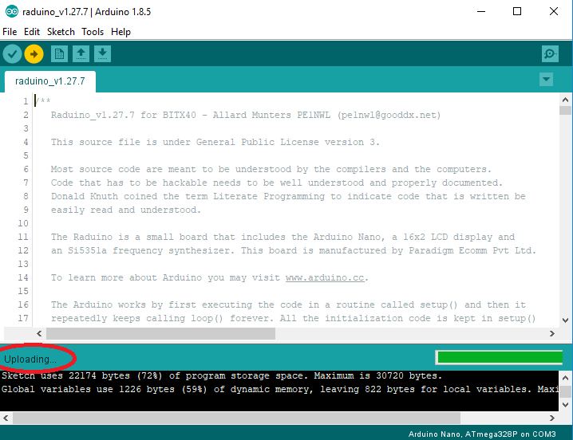

# INSTRUCTIONS D'INSTALLATION (pour Windows 10)- FRENCH

## APERCU

1. [Installation](#installer-l'ide-arduino) l'environnement de développement intégré sur votre PC (IDE)

2. [Installation](#installer-la-bibliothèque) installer la librairie PinChangeInterrupt sur votre PC

3. [Téléchargement](#télécharger-le-croquis) télécharger le croquis (sketch) Raduino sur votre PC

4. [Ouvrir](#ouverture-du-sketch) Ouverture du croquis raduino dans l'IDE arduino

5. [Compiler](#compiler-le-croquis) compiler/vérifier le croquis raduino

6. Eteindre la radio

7. Connecter le cable USB

8. [Télécharger](#telecharger-le-sketch) charger le firmware dans la carte raduino

9. Déconnecter le cable USB 

10. Mise en marche de la radio

## Installer l'IDE Arduino 

L'IDE ARDUINO est le logiciel nécessaire à la compilation du programme raduino, il permet de telecharger celui-ci dans la puce microcontroleur arduino.
Le programme Raduino(appele "SKETCH" ou croquis en francais) est ecrit en C (Langage de programmation). Les instructions du programme doivent être translatées en code machine  de façon a ce que le microcontrôleur arduino puisse éxécuter les instructions : c'est la compilation.

le logiciel de l'IDE Arduino peut être téléchargé a l'adresse suivante:
https://www.arduino.cc/en/Main/Software
Cliquez sur le lien "Windows Installer, for Windows XP and up" :

Cliquez sur 'just download':

Sauvegarder le fichier téléchargé et lancer le programme d'installation ( il est conseillé d'utliser l'option "executer en tant qu'administrateur", clic bouton droit sur le fichier a éxécuter)

Voulez vous autoriser ce programme à effectuer des changements sur votre ordinateur? 
Cliquer 'OUI'.

Accepter  "the License Agreement:"

laisser tous les "checkboxs" sur on, juste appuyer sur 'Next':

Laisser le répertoire de destination tel quel, juste appuyer sur 'Install':

L'installation démarre, cela va prendre quelques minutes pour extraire et installer tous les fichiers

Quand l'installation est terminée, presser "Close":

Une nouvelle icone a été créée sur le bureau. Faire un double-click pour lancer le programme IDE:

le logiciel IDE arduino démarre, cela prend quelques secondes

Quand celui-ci est enfin prêt, aller dans "files" cliquez sur "preferences", une fenêtre s'ouvre a la ligne "choose language" sélectionner "language système" cela mettra le menu en français si votre pc est en français, il faudra relancer le programme pour que cela prenne effet.  

Quand le programme est démarré, aller dans "Outils" => "Type de carte" => sélectionner arduino Nano:

puis ensuite aller dans "Outils" => "Processeur:" => selectionner ATmega328P: 

puis ensuite aller dans "Outil" => "Programateur:" => sélectionner AVRISP mkII:

## installer la bibliothèque (library) PinChangeInterrupt

Cette version de croquis (sketch) requiert la bibliothèque ["PinChangeInterrupt"](https://playground.arduino.cc/Main/PinChangeInterrupt) pour la gestion des interruptions.
C'est une librairie non-standard, c'est a dire qu'elle n'est pas installée par défaut. Executer les différentes étapes suivantes pour l'installer sur votre PC
Vous devez faire seulement ceci:

1. Aller dans 'Croquis' => 'Inclure une Bibliothèque' => 'Gérer les Bibliothèques...':

2. Le gestionnaire de bibliothèques devrait démarrer. Attendez jusqu'à ce que la liste complete des bibliothèque soit affichée:

3. Dans la fenêtre de recherche entrer "pinchangeinterrupt":

4. Sélectioner la bibliothèque nommée "PinChangeInterrupt by NicoHood", puis presser "installer":

5. Attendez que l'installation soit terminée et presser "fermer"

## Télécharger le croquis

Sur la page GitHub cliquez sur le bouton vert  "Clone or download":

puis cliquez sur 'download ZIP':

Le fichier sera téléchargé dans le répertoire "Téléchargements"
Allez dans ce répertoire , cherchez le fichier nommé  "bitx40-master", 
et double-cliquer sur celui-ci :

Cliquez sur  "Extract":

Et ensuite sur "Extract All":

Si vous le souhaitez, vous pouvez changer de répertoire de destination ou seront extraits  les fichiers du croquis
ensuite cliquez sur  "Extract":

un nouveau répertoire nommé "bitx40-master" sera créé à l'endroit que vous avez choisi dans l'étape précédente

Le nouveau répertoire créé "bitx40-master" contient différents fichiers. l'un d'eux se nomme "raduino_v1.xxx.ino". C'est le programme actuel  Raduino (firmware).

## Ouverture du sketch

Dans le répertoire "bitx40-master",cherchez le fichier "raduino_v1.xxx.ino" et double-cliquez dessus :

L'IDE Arduino devrait démarrer.:

Le message suivant devrait apparaître. Pressez OK:

Le croquis devrait être ouvert le le code du programme devrait être affiché sur l'IDE:

## Compiler le croquis

Dans l' IDE, pressez le bouton  "vérifier/compiler" :

La compilation démarre et prend quelques minutes :

Quand la compilation est terminée, l'écran suivant apparait:

## Télécharger le sketch

En premier éteindre la radio
Connecter le câble USB.

L'afficheur du Raduino devrait s'allumer parce qu'il reçoit une alimentation du PC via le câble USB, par contre la radio elle ne marche pas 

Dans l'IDE pressez le bouton "Téléchargement" :

Le croquis sera de nouveau compilé, cela prends quelques minutes:

Puis le croquis sera téléchargé, cela devrait prendre une minute ou plus:

Téléchargement Terminé:

Le Raduino redémarre, le numéro de version du nouveau croquis (firmware) devrait apparaître brièvement sur l'afficheur :

Déconnectez le cable USB.

Allumez la radio. le Raduino démarre.

Amusez-vous avec le nouveau Raduino. Happy BitX-ing!
73' de Jacques F1APY

