# INSTALLATION INSTRUCTIONS (for Windows 10)

## OVERVIEW

1. [Install](#installing-the-arduino-ide) the Arduino IDE on your PC

2. [Install](#installing-the-pinchangeinterrupt-library) the PinChangeInterrupt Library on your PC

3. [Download](#downloading-the-sketch) the Raduino sketch to your PC

4. [Open](#opening-the-sketch) the Raduino sketch in your IDE

5. [Compile](#compiling-the-sketch) the Raduino sketch

6. Power OFF the radio

7. Connect the USB cable

8. [Upload](#uploading-the-sketch) the firmware to the Raduino board

9. Disconnect the USB cable

10. Power ON the radio

## Installing the Arduino IDE

The Arduino IDE (Integrated Development Environment) is a piece of software that is needed to "compile" the software and then upload it to the Arduino microcontroller chip.
The Raduino software (or "sketch") is written in C (a programming language). The program statements in the sketch must be "translated" to digital instruction codes that the Arduino microcontroller can understand and execute. This translation process is called "compiling".

The Arduino IDE software can be downloaded for free from https://www.arduino.cc/en/Main/Software
Click on the link 'Windows Installer, for Windows XP and up':

Then click on 'just download':

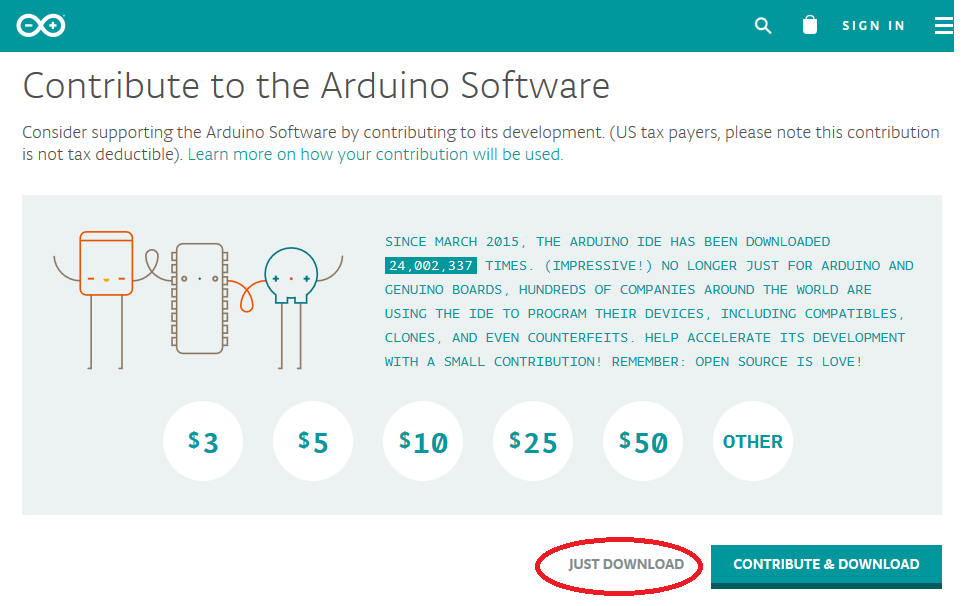

Save the downloaded file and execute it.
Do you want to allow this app to make changes to your device? Click 'YES'.

Accept the License Agreement:

Leave all checkboxes on, just press 'Next':

Leave the Destination Folder as is, just press 'Install':

The installation will start, it will take a minute or so to extract and install all files:

When the installation is completed, press "Close":

A new Arduino icon has been created on your desktop. Double-click it to start the IDE:

The IDE software will start:

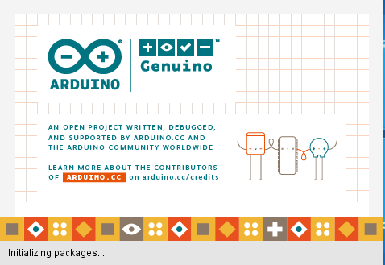

When it is ready, go to "Tools" => "Board:" => select Arduino Nano:

Then go to "Tools" => "Processor:" => select ATmega328P:

Then go to "Tools" => "Programmer:" => select AVRISP mkii:

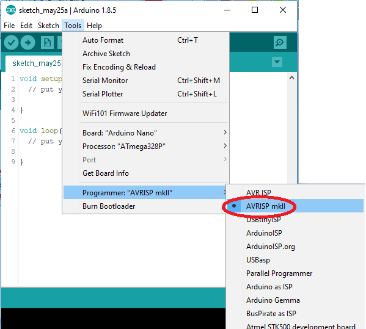

## Installing the PinChangeInterrupt Library

This sketch version requires the library ["PinChangeInterrupt"](https://playground.arduino.cc/Main/PinChangeInterrupt) for interrupt handling.
This is a non-standard library (it is not installed by default). Execute the following steps to install it onto your PC.
You only need to do this once.

1. Go to 'Sketch' => 'Include Library' => 'Manage Libraries...':

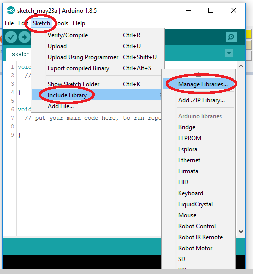

2. The Library Manager will be started. Wait until the list of installed libraries is updated:

3. In the search box, enter "pinchangeinterrupt":

4. Select the libary named PinChangeInterrupt by NicoHood, then press "install":

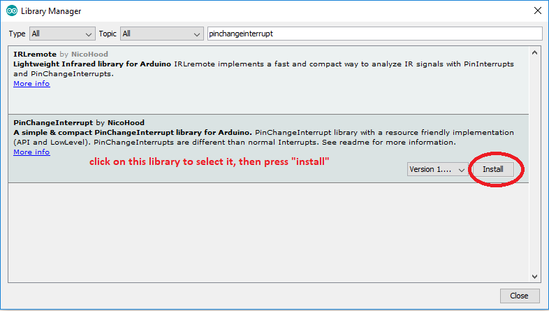

5. Wait until the installation is completed, then press "close":

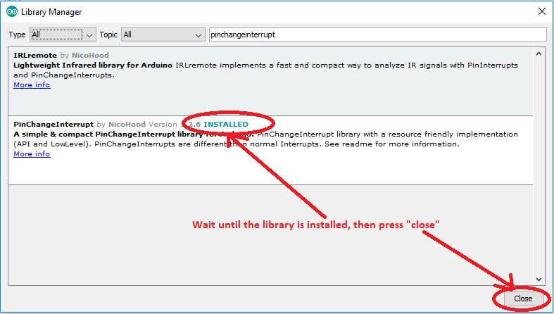

## Downloading the sketch

On the github page, click the green button "Clone or download":

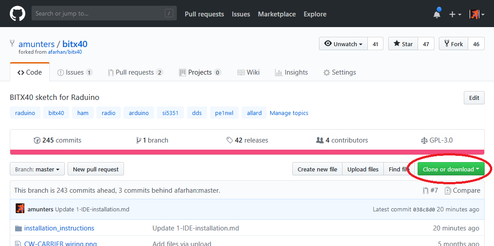

Then click on 'download ZIP':

The file will be downloaded to the download folder on your PC.
Go to your downloads folder, find the file named "bitx40-master", and double-click it:

Click on "Extract":

And then "Extract All":

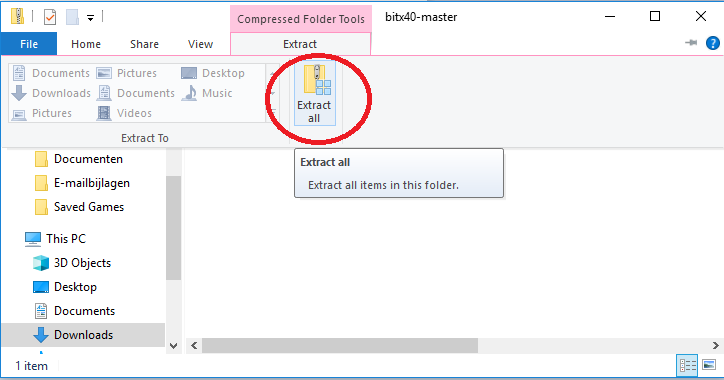

Optionally, use the "browse" button to change the location where the files will be extracted to.
Then press "Extract":

A new folder named "bitx40-master" will be created on the location you selected in the previous step:

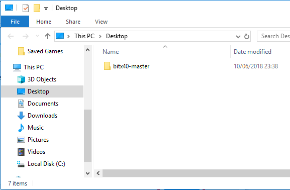

The newly created folder "bitx40-master" contains several files. One of them is named "raduino_v1.27.7.ino". This is the actual Raduino firmware.

## Opening the sketch

In the folder "bitx40-master", locate the file "raduino_v1.27.7.ino" and double-click it:

The Arduino IDE will be started:

The following message box may appear. Press OK:

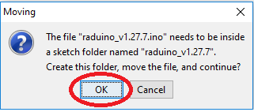

The sketch will now be opened and the program code will be shown in your IDE:

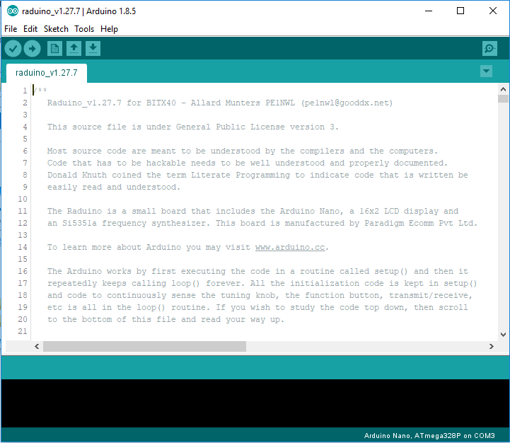

## Compiling the sketch

In the IDE, press the "verify/compile" button:

Compilation will now start, it may take several minutes to complete:

When the compilation is completed following screen will be shown:

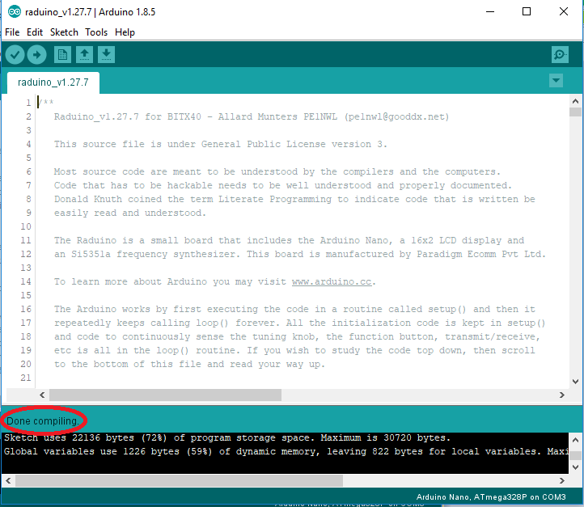

## Uploading the sketch

First power OFF the radio
Then connect the USB cable.
The Raduino display will light up because at this time it receives power from the PC via the USB cable - the radio itself will not work though.

In the IDE, press the "upload" button:

The sketch will first be compiled again, this may take a few minutes:

Then the sketch will be uploaded to the Arduino, this will take another minute or so:

Uploading is completed:

The Raduino will boot up again, the version number of the new firmware will briefly be shown on the display:

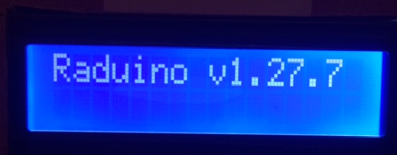

Disconnect the USB cable.

Power ON the radio. The Raduino will boot up.

Enjoy the new firmware. Happy BitX-ing!

