# Installing the Arduino IDE

The Arduino IDE (Integrated Development Environment) is a piece of software that is needed to "compile" the software and then upload it to the Arduino microcontroller chip.
The Raduino software (or "sketch") is written in C (a programming language). The program statements in the sketch must be "translated" to digital instruction codes that the Arduino microcontroller can understand and execute. This translation process is called "compiling".

The Arduino IDE software can be downloaded for free from https://www.arduino.cc/en/Main/Software
Click on the link 'Windows Installer, for Windows XP and up':

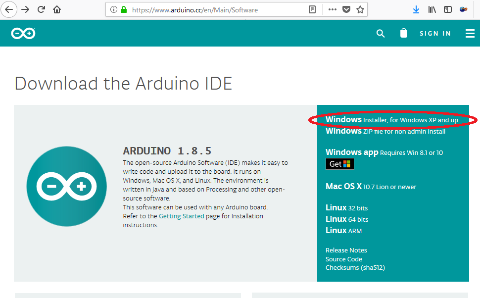

Then click on 'just download':

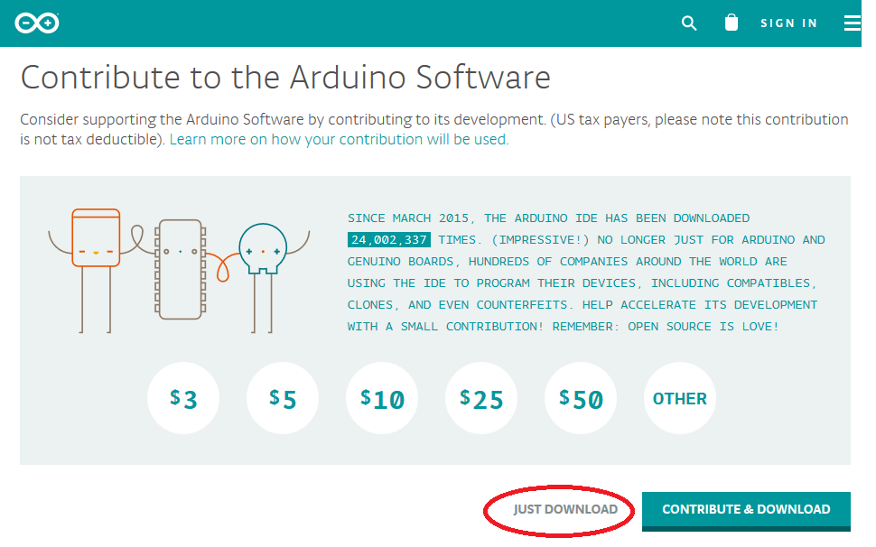

Save the downloaded file and execute it.
Do you want to allow this app to make changes to your device? Click 'YES'.

Accept the License Agreement:

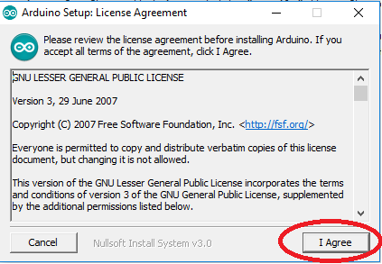

Leave all checkboxes on, just press 'Next':

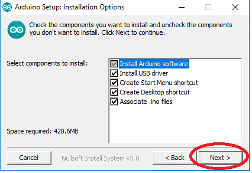

Leave the Destination Folder as is, just press 'Install':

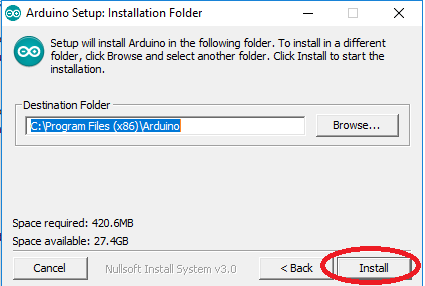

The installation will start, it will take a minute or so to extract and install all files:

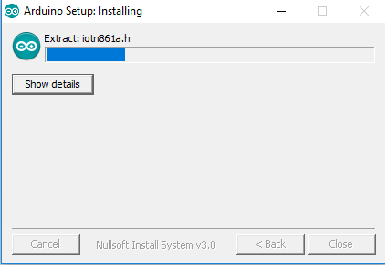

When the installation is completed, press "Close":

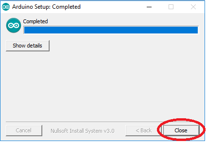

A new Arduino icon has been created on your desktop. Double-click it to start the IDE:

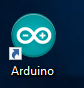

The IDE software will start:

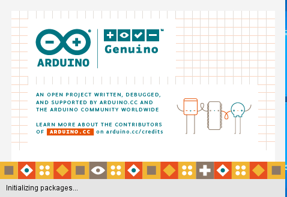

When it is ready, go to "Tools" => "Board:" => select Arduino Nano:

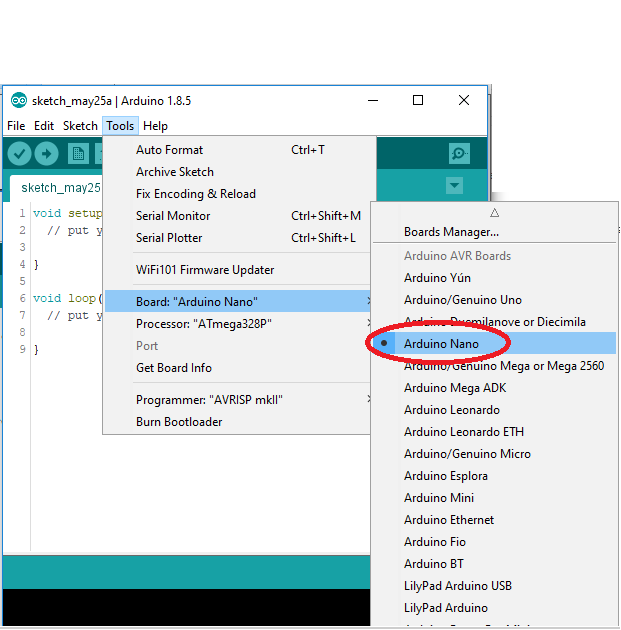

Then go to "Tools" => "Processor:" => select ATmega328P:

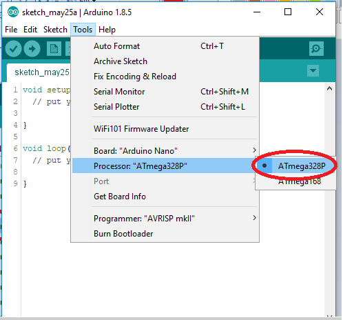

Then go to "Tools" => "Programmer:" => select AVRISP mkii:

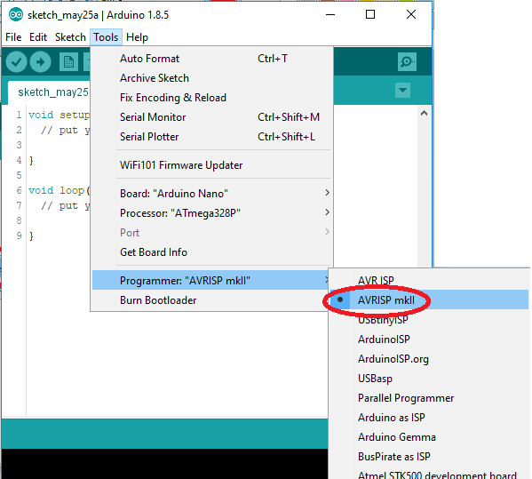
