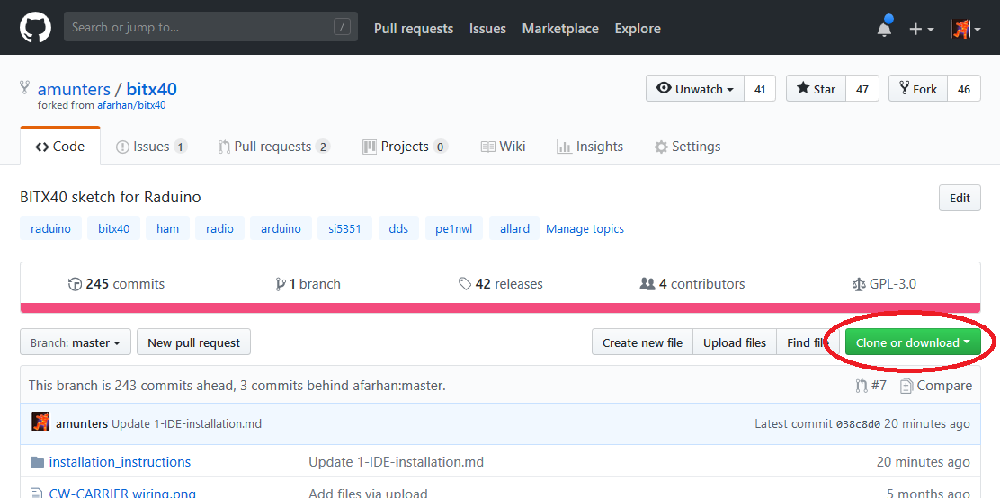
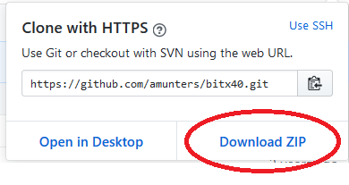
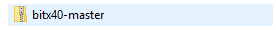
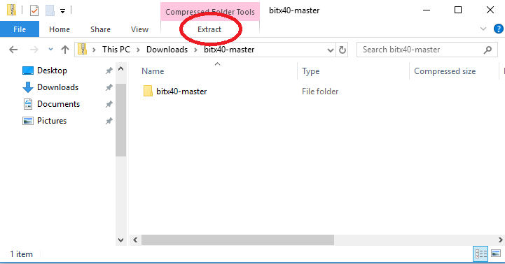
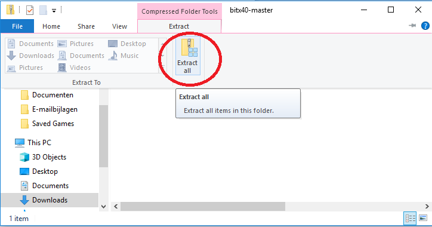
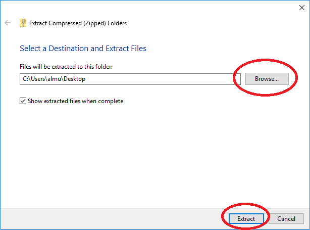
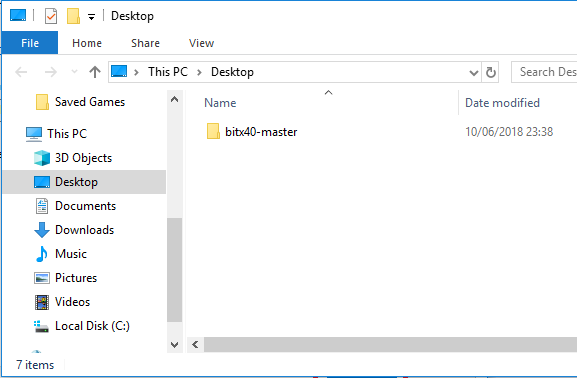
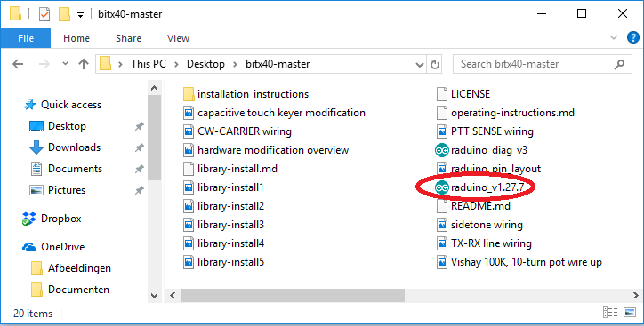

# Downloading the sketch

On the github page, click the green button "Clone or download":

Then click on 'download ZIP':

The file will be downloaded to the download folder on your PC.
Go to your downloads folder, find the file named "bitx40-master", and double-click it:

Click on "Extract":

And then "Extract All":

Optionally, use the "browse" button to change the location where the files will be extracted to.
Then press "Extract":

A new folder named "bitx40-master" will be created on the location you selected in the previous step:

The newly created folder "bitx40-master" contains several files. One of them is named "raduino_v1.27.7.ino". This is the actual Raduino firmware.

