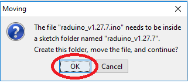
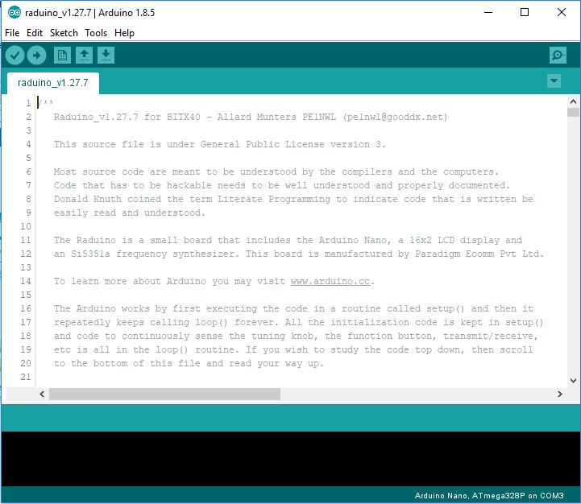

# Opening the sketch

In the folder "bitx40-master", locate the file "raduino_v1.27.7.ino" and double-click it:

The Arduino IDE will be started:

The following message box may appear. Press OK:

The sketch will now be opened and the program code will be shown in your IDE:

