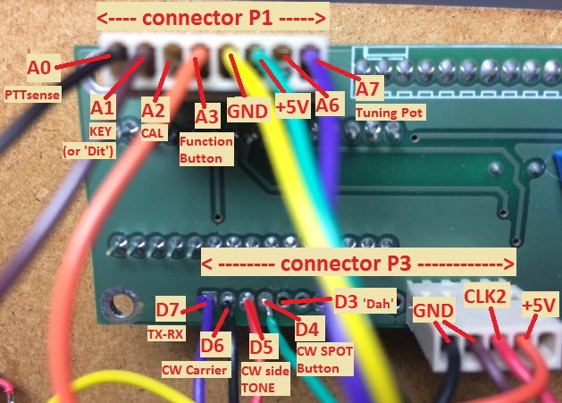

## Instructions utilisateur pour le Raduino_v1.28

**IMPORTANT**: Cette version du croquis nécessite la librairie ["PinChangeInterrupt"](https://playground.arduino.cc/Main/PinChangeInterrupt) pour le support d'interruption. Utiliser votre IDE pour [l'installer](Installer la bibliothèque PinChangeInterrupt - french.md) avant de compiler ce croquis!

Après une mise à jour, toutes les données d'étalonnage, les paramètres de niveau de lecteur, etc. seront réinitialisés aux valeurs d'usine.
Avant de mettre à jour, inscrivez vos valeurs d'étalonnage, etc. Après la mise à jour, utilisez le bouton de fonction pour les rétablir.
Sans aucune modification matérielle, le croquis fournit des fonctionnalités de base LSB. En fonction du choix de l'utilisateur, des fonctionnalités supplémentaires fournies par ce logiciel peuvent être activées en installant les modifications matérielles (minimales) associées.
Voir le tableau ci-dessous indiquant quelles modifications sont requises pour chaque fonction. Les détails de chaque modification sont décrits ci-dessous.

## Prévention des transmissions hors bandes

Le logiciel restreint la transmission à la bande radio-amateur 40m allouée. Pas défaut c'est celle de l'UIT région 2 (Ameriques : 7000-7300 kHz). Si vous êtes localisés dans une UIT différente, dé-commenter UNE des lignes 44-47 en fonction de votre emplacement, et recompiler.

Si la [PTTsense-mod](#cablage-de-ptt-sense-) est installée, l'émission (TX) hors bande sera désactivée, mais la réception (RX) est encore possible en dehors de la bande.
Si la [PTTsense-mod](#cablage-de-ptt-sense-) n'est PAS installée, l'émission(TX) et la réception(RX) seront toutes les deux désactivés en dehors de la bande.

Pour inhiber cette fonctionnalité, dé-commenter la ligne 47 (define REGION 0) (normallement pas recommandé!).

## POTENTIOMETRE D'ACCORD 10-TOURS

La plage de fréquence par défaut du potentiomètre 1 tour standard fourni n'est que de 50 kHz.
Si vous installez un potentiomètre de 10 tours, vous pouvez étendre la portée pour une couverture complète de la bande des 40 m.

Utilisation du Bouton de Fonction, aller au menu SETTINGS [réglage de la plage de réglage](#gamme-daccord).

## CABLAGE DU BOUTON DE FONCTION :

Connecter un bouton poussoir momentané entre la broche A3 (connecteur P1, fil orange) et la masse.
Les résistances de tirage internes de l'Arduino sont utilisées, donc n'installez PAS de résistance de tirage externe!

Vous n'avez pas de bouton de fonction (encore)?
Si vous n'installez pas de bouton poussoir, les fonctions de base LSB continueront de fonctionner.
(bien sûr, vous allez manquer le double VFO, RIT, SPLIT, USB, CW, etc.).
L'étalonnage peut encore être effectué à l'ancienne en utilisant le bouton CAL (connecteur P1, broche A2 - fil rouge).
Le réglage de la plage d'accord peut être «codé en dur» en éditant les lignes 34 à 36 et en adaptant les valeurs à vos besoins. Après la recompilation et le téléchargement sur votre Raduino, basculez momentanément le fil CAL rouge sur masse pour initialiser les nouveaux paramètres.

## PIN LAYOUT

### Connecteur P1 (8 broches)

* A0 (noir): PTTSense
* A1 (marron): clé, "point"
* A2 (rouge): CAL
* A3 (orange): Bouton de Fonction
* GND (jaune)
* +5V (vert)
* A6 (bleu): non utilisé
* A7 (violet): Potentiomètre d'Accord

### Connecteur P3 (16 broches)

Les 11 premières broches n'ont pas d'entête (tampons seulement):

* D7: TX-RX
* D6: CW Carrier
* D5: CW Side Tone
* D4: CW SPOT Button
* D3: clé, "trait"
* ??: Non utilisé
* ??: Non utilisé
* ??: Non utilisé
* ??: Non utilisé
* ??: Non utilisé
* ??: Non utilisé

La broche 5 entête

* GND (noire)
* GND (marron)
* CLK2 (rouge)
* +5V (orange)
* ?? (jaune): Non utilisé

## Cablage de PTT SENSE :

Connecter la broche A0 (connecteur P1, fil noir) via une résistance de 10K à la sortie de U3 (régulateur LM7805) sur la carte du BITX40.

Quand le PTT n'est pas appuyé (mode réception RX), le régulateur sera éteint, on verra 0 volt sur la broche A0 (LOW).
Quand le PTT est appuyé (mode émission TX), le régulateur sera allumé, alors on verra +5 volts sur la broche A0 (HIGH).
Le PTT SENSE est nécessaire pour les fonctionnalités CW, RIT, SPLIT, and for disabling frequency updating during TX
(to prevent "FM-ing"). Si vous n'installez pas le PTT SENSE, les opérations LSB et USB fonctionneront toujours normalement.

## CONNEXION D'UNE CLE MORSE DROITE ou d'un BOUTON «TUNE» :

Une clé droite (ou un manipulateur électronique externe) peut être connectée à la broche A1 du Raduino (connecteur P1, fil marron).
Il est recommandé d'installer une résistance série 1Kohm pour protéger l'entrée Arduino. Lorsque la clé est ouverte, la broche A1 sera HIGH.
Lorsque la clé est abaissée (fermée, court-circuitée à la masse), la broche A1 sera LOW et une porteuse sera transmise.

Vous pouvez également câbler un simple bouton-poussoir au lieu de connecter une clé morse. La porteuse CW générée peut être utilisée pour régler votre antenne. Dans ce cas, veuillez noter que vous transmettez une porteuse à plein cycle, par conséquent, ne maintenez pas le bouton de réglage enfoncé trop longtemps pour éviter la surchauffe du final (PA)!

## CLE AUTOMATIQUE - CONNEXION D'UN PADDLE :

Le Raduino est configuré pour opérer avec une clé droite par défaut. Si vous souhaitez utiliser un manipulateur automatique, accédez au menu SETTINGS et sélectionnez «CW parameters» => «Key-type», puis sélectionnez «paddle», «Rev». paddle '(pour les opérateurs gauchers), 'bug' ou'rev.bug'.
Connectez le contact "point" à la broche A1 du Raduino (connecteur P1, fil marron).
Connectez le contact 'trait' à la broche D3 du Raduino (connecteur P3).
Il est recommandé d'installer des résistances série 1Kohm pour protéger les entrées de l'Arduino.
Le clé intégrée fournit le mode Iambic A et la fonctionnalité "bug" (émulation Vibroplex) et les palettes peuvent être inversées.

## CONTRÔLE DE VITESSE DE LA CLE CW :

La vitesse peut être contrôlée à partir du panneau avant (plage de 1 à 50 WPM). Tout en tapant, appuyez et relâchez le FB pour augmenter la vitesse ou le bouton SPOT pour réduire la vitesse. Le réglage de la vitesse CW est mémorisé dans l'EEPROM.

## CLE TOUCHE CAPACITIVE :

Le croquis prend en charge la fonctionnalité tactile capacitive. Avec cette fonctionnalité, il est possible d'utiliser des capteurs tactiles au lieu d'une clé ou d'une palette mécanique. La clé droite manuelle ainsi que le fonctionnement automatique du manipulateur sont possibles via les capteurs tactiles.
Voir la démonstration suivante : https://www.youtube.com/watch?v=9MWM6UVy9k4

Une modification minimale (ajouter quatre résistances) est requise pour cette fonction.
Remarque : certains constructeurs ont signalé que le capteur tactile n’a pas été détecté de manière fiable lors de la mise sous tension. Dans ce cas, ajoutez de petits condensateurs (3-22pF) aux deux entrées afin d’augmenter légèrement la capacité interne de base.

Les capteurs tactiles capacitifs sont désactivés par défaut. Pour les activer, accédez au menu SETTINGS et sélectionnez «CW parameters» => «Touch sensor», puis utilisez le bouton de réglage pour définir la sensibilité souhaitée du capteur tactile.

Une bonne valeur de sensibilité pour commencer est 22. Augmentez la valeur pour plus de sensibilité. La valeur maximale est de 25.
Le réglage de la sensibilité est assez délicat et dépend de vos goûts personnels. Les meilleurs résultats sont généralement obtenus avec une sensibilité élevée. Cependant, si la sensibilité est trop élevée, la radio peut être asservie par des parasites électriques ou des objets à proximité des pavés tactiles. Il peut également arriver que la manipulation iambique se produise même si une seule tablette tactile est touchée. Réduisez la sensibilité si ces symptômes apparaissent. Par ailleurs, si la sensibilité est trop faible, le manipulateur peut ne pas répondre correctement aux touches tactiles, par exemple des doubles POINTS ou TRAITS peuvent être générés. Certaines expérimentations peuvent être nécessaires pour trouver le réglage optimal.
Les capteurs tactiles sont calibrés automatiquement au démarrage. Si vous souhaitez les recalibrer, éteignez et rallumez-le simplement, sans toucher les électrodes du capteur. Les données d'étalonnage du capteur seront affichées sur l'écran LCD au démarrage.
Remarque : Lorsque le manipulateur tactile est activé, le fonctionnement normal de la palette n’est pas possible. Si vous souhaitez utiliser une palette standard, désactivez les capteurs tactiles en réglant la sensibilité sur 0 (capteur tactile désactivé).

## CÂBLAGE CW-CARRIER:

Ceci est requis pour le fonctionnement en CW (ou pour générer une porteuse pour le réglage)
Connectez un fil de sortie Raduino D6 (connecteur P3, broche 15), via une résistance série 4.7K, à l'entrée du mélangeur.

Lorsque la clé est enfoncée, la sortie D6 sera HIGH. Cela injecte un peu de courant continu dans le mélangeur pour qu'il soit déséquilibré.
En conséquence, une porteuse CW sera générée.

Remarque : Si la porteuse n’est pas générée à pleine puissance de sortie, vous devrez peut-être réduire la résistance de la résistance série 4.7K à une valeur inférieure pour plus d'entraînement. Cependant, essayez de la garder aussi haut que possible pour garder un signal CW propre. N'utilisez jamais une résistance inférieure à 1K!
Conseil supplémentaire : à des fins de réglage, une porteuse réduite est généralement souhaitée. Vous pouvez éventuellement connecter un potentiomètre de 100K en série avec la résistance de 4.7K, cela vous permettra de réduire la force de la porteuse à un niveau approprié.

Le CW-CARRIER est uniquement requis pour la fonctionnalité CW. Si vous n'installez pas cette ligne, tout le reste fonctionnera normalement.

## CABLAGE TONALITE LATERALE CW (Side Tone) :

Une tonalité latérale est disponible sur la sortie Raduino D5 (connecteur P3, broche 14). Ce signal peut être envoyé au haut-parleur / au casque en parallèle avec la sortie de l'amplificateur audio existant.

La tonalité latérale(Side Tone) souhaitée peut être réglée à l'aide de la touche de fonction du menu SETTINGS.
La tonalité latérale(Side Tone) CW est uniquement utilisée pour le fonctionnement en CW. Si vous n'installez pas cette ligne, tout le reste fonctionnera normalement.

## CABLAGE TX-RX :

Ceci est nécessaire pour le fonctionnement en CW.

Lorsque la clé est enfoncée, la sortie D7 (connecteur P3, broche 15) sera HIGH. Il ne repassera à LOW que lorsque la clé est allumée depuis au moins 350 ms (cette valeur de temporisation peut être modifiée via le menu SETTINGS).
Ce signal est utilisé pour piloter un transistor NPN qui est connecté en parallèle au commutateur PTT existant, afin de contourner le commutateur PTT pendant le fonctionnement CW. Par conséquent, les relais seront activés tant que D7 est HIGH.
(Suggestion : si vous avez un connecteur combiné microphone/PTT, le transistor de dérivation PTT peut être soudé directement à l’arrière).
(Le transistor de dérivation PTT peut également être utilisé dans le futur pour la fonctionnalité VOX).

## Bouton CW SPOT/FINE TUNE :

Connecter un bouton-poussoir momentané entre la broche D4 (connecteur P3) et la masse.
Les résistances de traction internes d'Arduino sont utilisées, donc n'installez PAS de résistance de traction externes!
Lors de l'utilisation de la CW, il est important que les deux stations transmettent leurs porteuses sur la même fréquence.
Lorsque la touche SPOT est enfoncée alors que la radio est en mode réception(RX), le RIT sera désactivé et l’effet local sera généré.
(mais aucune porteuse ne sera transmise).

Tant que la touche SPOT est maintenue enfoncée, la radio passe temporairement en mode "FINE TUNE", ce qui permet de régler le VFO avec une précision de 1 Hz. Cette fonctionnalité fonctionne également en mode SSB (sauf qu'aucune zone latérale ne sera générée à ce moment-là).
Réglez le potentiomètre de manière à ce que la hauteur du signal CW reçu soit égale à la tonalité CW.
En alignant le ton CW Spot pour correspondre à la hauteur du signal d’une station entrante, vous provoquerez votre signal et
le signal de l'autre station est exactement sur la même fréquence (temps nul).
(Le bouton SPOT n'est qu'une aide supplémentaire et n'est pas strictement requis pour CW - si vous ne l'installez pas, le fonctionnement en CW est toujours possible).

## FONCTION DE VEROUILLAGE DU CADRAN

Appuyez simultanément sur le Bouton de Fonction et sur le bouton SPOT pour verrouiller le cadran.
Lorsque le cadran est verrouillé, l'accord sera désactivé, PTT et CW sont toujours possibles.
Appuyez à nouveau sur le bouton de fonction pour déverrouiller.

## PREVENTION DE RAFALE DE PARASITES

Afin d'éviter qu'une rafale parasite soit émise lors du passage de réception(RX) à émission(TX), un court délai (TX_DELAY) est appliqué.
Cette fonctionnalité ne fonctionnera que lorsque le [PTTsense-mod] (# ptt-sense-wiring) est installé.
Par défaut, le TX_DELAY est défini sur 65 ms. Le temps de retard peut être ajusté en éditant la ligne 80 si nécessaire.

## UTILISATION DU BOUTON DE FONCTION :

Plusieurs fonctions sont disponibles avec un seul bouton poussoir.
Certaines options de menu n'apparaîtront pas lorsque les modifications matérielles associées ne seront pas installées.

### Mode Opératoire

En mode opératoire normal :

* 1 pression courte - bascule VFO A/B
* 2 pressions courtes - RIT on (PTT sense est nécessaire pour cette fonction) (presser FB à nouveau pour basculer le RIT off)
* 3 pressions courtes - bascule SPLIT on/off (PTT sense est nécessaire pour cette fonction)
* 4 pressions courtes - bascule de mode (défiler à travers LSB-USB-CWL-CWU)
* 5 pressions courtes - début du mode SCAN de fréquence
* 6 pressions courtes - début du mode suivi VFO A/B
* pression longue (> 1 seconde) - VFO A=B

### Mode Settings (paramètres)

Pour entrer dans le menu SETTINGS, presser et maintenir le Bouton de Fonction pendant un temps VRAIEMENT long (>3 secondes).
 
#### Balayage de fréquence (SCAN)

1 pression courte - régler les paramètres de fréquence SCAN (limite inférieure, limite supérieure, taille du pas, délai du pas)

 - utiliser le potentiomètre d'accord, définir la limite de balayage de fréquence inférieure souhaitée
 - presser le Bouton de Fonction (FB)
 - utiliser le potentiomètre d'accord, définir la limite de balayage de fréquence supérieure souhaitée
 - presser le Bouton de Fonction (FB)
 - utiliser le potentiomètre d'accord, set the desired scan step size
 - presser le Bouton de Fonction (FB)
 - utiliser le potentiomètre d'accord, set the desired scan step delay (also used for A/B monitoring mode)
 - presser à nouveau le Bouton de Fonction (FB) pour sauvegarder les paramètres

#### Configuration CW

2 pressions courtes - régler les paramètres de la CW (tonalité de sidetone, type de clé CW, semiQSK on / off, délai QSK) (disponible uniquement lorsque la ligne PTTsense est installée)

 - utiliser le potentiomètre d'accord, sélectionner "straight" pour opérer avec une clé droite, "paddle" pour une clé CW automatique, "paddle" pour les opérateurs CW gauchers, "bug" ou "rev. bug".
 - presser le Bouton de Fonction (FB)
 - utiliser le potentiomètre d'accord, sélectionnez Auto-space ON ou OFF (uniquement lorsque le manipulateur CW automatique a été sélectionné)
 - presser le Bouton de Fonction (FB)
 - utiliser le potentiomètre d'accord, définir la sensibilité souhaitée du manipulateur tactile (0 = OFF) (uniquement lorsque la modification du capteur tactile est installée)
 - presser le Bouton de Fonction (FB)
 - utiliser le potentiomètre d'accord, sélectionnez semiQSK ON ou OFF (uniquement lorsque la modification TX-RX est installée)
 - presser le Bouton de Fonction (FB)
 - utiliser le potentiomètre d'accord, définir la valeur de temporisation souhaitée (ms) (uniquement lorsque semiQSK est activé)
 - presser à nouveau le Bouton de Fonction (FB) pour sauvegarder les paramètres
 - utiliser le potentiomètre d'accord, régler la hauteur de tonalité latérale désirée (side-tone pitch)
 - presser le Bouton de Fonction (FB)

#### Etalonnage VFO, LSB

3 pressions courtes - Calibrage de la fréquence du VFO en mode LSB

  - utiliser un autre émetteur-récepteur pour générer une porteuse à une fréquence connue (par exemple 7100,0 kHz)
(ou demander à un ami d'émettre une porteuse à une fréquence connue)
  - avant de passer en mode d'étalonnage, réglez d'abord le VFO sur 7100,0 kHz en mode LSB
(le signal reçu n'est peut-être pas encore au battement zéro - zero beat)
  - passer en mode d'étalonnage LSB (3 pressions courtes)
  - en utilisant le potentiomètre d'accord, ajustez la valeur de correction (ppm) pour exactement le battement zéro (zero beat)
  - appuyez à nouveau sur le Bouton de Fonction pour enregistrer le paramétrage

#### Etalonnage VFO, USB
  
4 pressions courtes - Étalonnage de la fréquence VFO en mode USB

  - L'étalonnage USB dépend de l'étalonnage LSB. Assurez-vous donc que l'étalonnage LSB a été effectué en premier!
  - utiliser un autre émetteur-récepteur pour générer une porteuse à une fréquence connue (par exemple 7100,0 kHz)
    (ou demander à un ami de transmettre une porteuse à une fréquence connue)
  - avant de passer en mode étalonnage, réglez d'abord le VFO sur 7100,0 kHz en mode USB
    (le signal reçu ne peut pas encore être au battement zéro à ce stade)
  - passer en mode étalonnage USB (4 pressions courtes)
  - en utilisant le potentiomètre d'accord, ajustez le décalage USB pour exactement le battement zéro
  - appuyez à nouveau sur le Bouton de Fonction pour enregistrer le paramétrage

#### Niveau d'entraînement du VFO, LSB
  
5 courtes pressions - réglez le niveau d'entraînement du VFO en mode LSB

  - syntoniser à 7199 kHz, sur la plupart des émetteurs-récepteurs BITX40, un birdie fort est entendu en mode LSB
  - donner 3 courtes pressions sur le Bouton de Fonction pour entrer dans le réglage du niveau d'entraînement du VFO
  - le niveau d'entraînement par défaut en mode LSB est de 4mA
  - en utilisant le potentiomètre d'accord, essayer différents niveaux d'entraînement (2,4,6,8 mA) pour minimiser la force du birdie
  - appuyez à nouveau sur le Bouton de Fonction pour enregistrer le réglage

#### Niveau d'entraînement VFO, USB 

6 courtes pressions - réglez le niveau d'entraînement du VFO en mode USB

  - syntoniser un signal faible
  - donner 4 petites pressions sur le Bouton de Fonction pour entrer dans le réglage du niveau d'entraînement du VFO
  - le niveau d'entraînement par défaut en mode USB est de 8mA
  - en utilisant le potentiomètre d'accord, essayez différents niveaux d'entraînement (2,4,6,8 mA) pour un rapport signal/bruit maximal
  - presser le Bouton de Fonction à nouveau pour enregistrer le réglage
  Note supplémentaire : Si le niveau d'entraînement maximum de 8mA est encore insuffisant pour le mode USB, la suppression de C91 et C92 peut aider.
Ces bouchons atténuent le signal du VFO à des fréquences plus élevées. Ils ne sont en fait nécessaires que pour le VFO analogique et peuvent être supprimés en toute sécurité si vous utilisez le DDS Raduino au lieu du VFO analogique.

#### Gamme d'accord

7 pressions cortes - réglage de la plage de réglage (fréquence minimum, fréquence maximum, durée du potentiomètre)

  - en utilisant le potentiomètre d'accord, réglez la fréquence de syntonisation minimale et appuyez sur le Bouton de Fonction
  - en utilisant le potentiomètre d'accord, réglez la fréquence de syntonisation maximale et appuyez sur le Bouton de Fonction à nouveau
 La durée de potentiomètre par défaut est de 50 kHz, ceci est correct pour un potentiomètre standard à 1 tour
  Si vous installez un potentiomètre multi-tours, vous pouvez étendre l'a durée'intervalle du potentiomètre
  - en utilisant le potentiomètre d'accord, définir l'intervalle du potentiomètre souhaité
    valeur recommendée : 50 kHz pour un potentiomètre 1-tour, 200 kHz pour un potentiomètre 10 tours
   (si la radio est principalement utilisée pour la CW : une plage de 10-25 kHz est recommandée)
  - presser le Bouton de Fonction à nouveau pour enregistrer le réglage

#### Sortie du menu Settings (Paramètres)
 
Un appui long (> 1 seconde) permet de quitter le menu SETTINGS et de revenir au mode de fonctionnement normal (# mode de fonctionnement)

Tous les paramètres utilisateur sont stockés dans EEPROM et récupérés lors du démarrage.

### Paramètres d'usine

Pour réinitialiser tous les paramètres utilisés aux valeurs "usine", appuyez sur le Bouton de Fonction et maintenez-le enfoncé pendant la mise sous tension. Les paramètres d'usine sont :

* VFO calibration value : 180 ppm
* VFO calibration offset (USB) : 1500 Hz
* VFO drive level (LSB) : 4mA
* VFO drive level (USB) : 8mA
* Minimum frequency : 7000 kHz
* Maximum frequency : 7300 kHz
* Tuning pot span : 50 kHz
* Mode LSB for both VFO A and B
* CW side tone : 800 Hz
* CW key-type: Straight key
* Touch sensors: OFF
* Auto-space: OFF
* semiQSK: ON
* QSK delay: 350 ms
* Lower scan limit: 7100 kHz
* Upper scan limit: 7150 kHz
* Scan step: 1 kHz
* Scan step delay: 500 ms

Un message d'avertissement "VFO uncalibrated" sera affiché jusqu'à ce que vous réétalonniez à nouveau le VFO.
